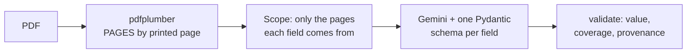
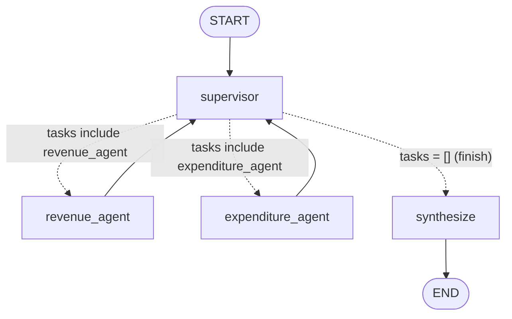

# HTX AI Engineering Take-Home

LLM work over one source document: the Singapore Ministry of Finance's *Analysis of Revenue and Expenditure, Financial Year 2024* (37 pages, distributed on Budget Day, 16 February 2024).

| Part | Notebook | What it does |
|---|---|---|
| 1. Document Extraction & Prompt Engineering | [`part1.ipynb`](part1.ipynb) | Compares four PDF parsers, then extracts five fields with structured LLM output, each carrying a verbatim quote and page, and validates them against values read by hand. |
| 2. Tool Calling & Reasoning | [`part2.ipynb`](part2.ipynb) | Extracts two dates, normalises them to ISO format through a **local MCP server**, then has the LLM classify each date against 2024-01-01. |
| 3. Multi-Agent Supervisor | [`part3.ipynb`](part3.ipynb) | A LangGraph supervisor that routes a question to a Revenue Agent, an Expenditure Agent or both, then writes one answer from their reports. |

Each notebook is written to be read top to bottom: it looks at the document first, states every design decision and assumption where it is made, runs the LLM, and checks the output.

---

## Repository layout

```
.
├── part1.ipynb                     # Part 1
├── part2.ipynb                     # Part 2
├── part3.ipynb                     # Part 3
├── mcp_servers/
│   ├── datetime_server.py          # Part 2: the MCP server used for date normalisation
│   └── probe_server.py             # Part 2: exploration-only server used to compare transports
├── data/                           # not in git - put the source PDF here (see Configure)
├── requirements.txt                # everything needed to run all three parts
├── requirements-parser-eval.txt    # optional: only for Part 1's parser comparison (§1.2-1.3)
└── .env.example                    # template for the API key
```

`mcp_servers/*.py` are generated by `%%writefile` cells in `part2.ipynb`, so re-running Part 2 rewrites them.

---

## Configure

### 1. Python environment

Developed on **Python 3.14.7**.

```bash
python -m venv .venv
source .venv/bin/activate          # Windows: .venv\Scripts\activate
pip install -r requirements.txt
```

Optional, only to reproduce the parser comparison in Part 1 §1.2–1.3. It is heavy: Docling pulls in torch and transformers (~1.8GB) and downloads model weights from Hugging Face Hub on first use.

```bash
pip install -r requirements-parser-eval.txt
```

Without it, Part 1 §1.2 reports that Docling and MarkItDown are unavailable and carries on.

### 2. API key

All three parts call Google's `gemini-3.1-flash-lite` model. Create a key at [Google AI Studio](https://aistudio.google.com/apikey), then:

```bash
cp .env.example .env
# edit .env:
GOOGLE_API_KEY=your_key_here
```

The notebooks load it with `python-dotenv` from `.env` in the repository root. `.env` is git-ignored.

### 3. Source document

`data/` is git-ignored, so the PDF has to be added by hand. Download the *Analysis of Revenue and Expenditure, Financial Year 2024* PDF (linked in the take-home brief) and save it as:

```
data/fy2024_analysis_of_revenue_and_expenditure.pdf
```

Each notebook's setup cell asserts that this file exists.

---

## Run

1. Open a notebook in **VS Code** (with the Jupyter extension) or **Jupyter**, and select the `.venv` interpreter as the kernel. `ipykernel` is in `requirements.txt`; the Jupyter front end is not, so install `jupyterlab` separately if you want it.
2. Run the cells **top to bottom**, from the repository root, since paths such as `data/...` and `mcp_servers/...` are relative.

Notes per part:

| Part | Notes |
|---|---|
| 1 | §1.2 times each parser on two pages; with Docling installed this is the slow part. Everything from §1.4 on only needs `pdfplumber`. |
| 2 | Uses top-level `await`, so it must run in a Jupyter kernel, not as a plain Python script. The notebook starts the MCP server itself over stdio; no separate server process is needed. §2.6 briefly starts the probe server over HTTP on a free local port and stops it again. |
| 3 | Synchronous; runs in any Jupyter kernel. The §9 summary table was filled in by hand from the printed outputs of §7 and §8. |

To start the date server on its own (it speaks MCP over stdin/stdout, so it waits for an MCP client):

```bash
python mcp_servers/datetime_server.py
```

All LLM calls use `temperature=0` and are retried on API errors.

---

## System design

### Shared foundations (all parts)

| Piece | How it works | Why |
|---|---|---|
| Parsing | `pdfplumber.extract_text()` for every page, stored as `PAGES: dict[int, str]` keyed by **printed page number** | Chosen in Part 1 §1.4: keeps a table row on one line, unlike PyMuPDF, without Docling's size and latency. Part 1 §1.1 verified printed page N = PDF index N−1. |
| Context format | Pages passed to the LLM as `<page number="N">…</page>` blocks (`context_for()`) | The model can cite the page each fact came from. |
| Structured output | Pydantic schemas with the **evidence first** (page, verbatim quote) and the value after | The value is read off the quote rather than produced independently, and the quote can be checked against the page. |
| Validation | Every run is checked in code against values read by hand from the PDF, including a "quote appears on the cited page" check | "The LLM returned a number" is not the same as "the LLM returned the right number". |
| Prompt iteration | Prompt v1 → run → read output → prompt v2, through the same functions | Changes are driven by observed failures, and results stay comparable. |

### Part 1 — Document extraction



- **One LLM call per field, each seeing only its own page(s)** (`FIELD_PAGES`). §2.2 shows a pooled call over several pages taking a correctly labelled figure off the wrong page.
- **Prompt v2 fixes what v1 got wrong** (§3.1–3.2): fields may be `null` when the cited page has no figure for the requested year; Field 5 writes `reasoning`, `financial_year` and `basis` before `value`; the tax list is classified item by item (`is_tax`) and filtered in code.
- **The LLM never calculates**; every value is one the document states.

### Part 2 — Tool calling through a local MCP server


- **Extraction (§5):** one tool-calling loop per date, each seeing only its own page. The model calls `normalize_date` itself; the answer schema `ExtractedDate` is offered as one more tool, with `tool_choice="any"`, so handing in the answer ends the loop. At most 5 turns.
- **Classification (§6):** one structured-output call per date against the reference date 2024-01-01, with few-shot examples not taken from the document. Code carries `original_text` and `normalized_date` through unchanged; only `status` comes from this step.
- **Decisions (§3):** stdio transport (the client starts and stops the server; no port), the official SDK's `FastMCP`, and `langchain-mcp-adapters` on the client side.

### Part 3 — Multi-agent supervisor



Dashed arrows are the supervisor's choices; solid arrows always run.

| Node | What it does |
|---|---|
| `supervisor` | Reads the question and the reports so far, then returns `Route(reasoning, tasks)`: why, and which agent(s) get which task. One task → one agent; two tasks → both agents in parallel (LangGraph `Send`); no tasks → finish. |
| `revenue_agent` | Finds and extracts government revenue figures from the document, citing page and quote. When asked for "key" items, reports the 5 largest by value, excluding totals. |
| `expenditure_agent` | Finds government spending and fund figures, citing page and quote. Reads totals the document states; uses the `add_numbers` tool only when an answer needs several values added up, never its own arithmetic. |
| `synthesize` | Writes the final answer from the agents' reports only, citing pages. |

Design decisions (details in `part3.ipynb` §2):

| Decision | Why |
|---|---|
| Hand-built `StateGraph` rather than agents-as-tools | Every routing decision is a typed `Route` with its reasoning attached, the graph can be drawn, and synthesis is a separate step. |
| Hybrid dispatch: one agent or both per step | Independent parts run in parallel; a part that needs another agent's figure can still wait for it. |
| Agents search the whole document with tools, no hand-picked page lists | Revenue and spending share tables (Table 2.1 on p16 holds both), and page lists would be manual and hardcoded. |
| Worker agents built with LangChain's `create_agent` | Part 2 already wrote a tool loop by hand; the new part here is the supervisor. |
| `MAX_STEPS = 3` | Only the first 3 supervisor decisions can send agents, so a supervisor that keeps re-routing cannot loop forever. |
| Keyword search instead of RAG | Explained in §10, together with the limitation that exact-wording search brings. |

Results: the task query and three further queries (revenue only, expenditure only with a sum, both agents combined) each routed to the expected agents and passed all their checks (§9).

---

## API reference

### MCP server — `mcp_servers/datetime_server.py`

| Tool | Signature | Behaviour |
|---|---|---|
| `normalize_date` | `normalize_date(text: str) -> str` | Converts **one** written date to `YYYY-MM-DD`. Accepts `16 February 2024`, `16 Feb 2024`, `February 16, 2024`, `Feb 16, 2024`, `February 16 2024` and `2024-02-16`; surrounding spaces and `. , ; :` are stripped. Raises `ValueError` for anything else, including numeric day/month dates like `03/04/2024` (ambiguous) and date ranges. Over MCP the error comes back as a tool error message, so the LLM can read it and retry. |

Transport: stdio (`mcp.run(transport="stdio")`).

### Part 3 agent tools

| Tool | Used by | Signature | Returns |
|---|---|---|---|
| `search_pages` | both agents | `search_pages(keyword: str) -> str` | One `page N: line` per line containing `keyword` (case-insensitive), or a message suggesting another keyword. |
| `read_page` | both agents | `read_page(page: int) -> str` | The full text of one printed page (1–37) in a `<page number="N">` block, or a message if the page doesn't exist. |
| `add_numbers` | Expenditure Agent | `add_numbers(numbers: list[float]) -> float` | The sum, rounded to 6 decimal places. |

### Main notebook functions

| Part | Function | Purpose |
|---|---|---|
| 1 | `context_for(page_numbers)` | Render chosen pages as `<page number="N">` blocks. |
| 1 | `run_extraction(schemas, system_prompt)` | One structured-output call per field over that field's pages; the same function runs prompt v1 and v2. |
| 1 | `validate(extracted)` / `score(extracted)` | Check value, tax-list coverage and quote provenance per field. |
| 2 | `extract_date(system_prompt, request, pages)` | Async tool-calling loop over the MCP tool for one date; returns the `ExtractedDate` and a log of every tool call. |
| 2 | `check_extraction(extracted, tool_logs)` | Correct date, ISO format, date came from a successful tool call, quote on cited page. |
| 2 | `run_classification(system_prompt, extracted)` | One `DateStatus` call per date. |
| 3 | `make_agent(system_prompt, tools)` | A `create_agent` tool loop that must end with an `AgentReport`. |
| 3 | `build_graph(prompts)` | Build and compile the supervisor graph from a dict of four prompts (`supervisor`, `revenue`, `expenditure`, `synthesize`). |
| 3 | `run_query(graph, question)` | Stream the graph, print the trace (routing decisions, tool calls, findings, final answer), return the final state. |
| 3 | `check(state, expected)` | Grade a run: routing, expected facts in the answer, sum from `add_numbers` where expected, quotes on cited pages, no other-year figure labelled FY2024. |

### Output formats

**Part 2 final output** (one entry per date):

```json
[
  {"original_text": "Distributed on Budget Day: 16 February 2024", "normalized_date": "2024-02-16", "status": "Upcoming"}
]
```

**Part 3 schemas:**

| Schema | Fields |
|---|---|
| `Finding` | `source_page`, `quote`, `item`, `financial_year`, `value`, `unit` |
| `AgentReport` | `findings: list[Finding]`, `summary` |
| `Route` | `reasoning`, `tasks: list[AgentTask]` |
| `AgentTask` | `agent` (`revenue_agent` or `expenditure_agent`), `task` |

---

## Dependencies and why

| Package | Version | Used in | Why this library |
|---|---|---|---|
| `pdfplumber` | 0.11.10 | 1, 2, 3 | Chosen parser (Part 1 §1.4): keeps each table row on one line and supports cropping a page region, which Part 2 §5.2 uses to read a two-column page one column at a time. |
| `pymupdf` | 1.28.2 | 1 | Fastest text extraction; used for the page-number mapping check (§1.1) and as a baseline in the parser comparison. |
| `langchain` | 1.4.0 | 3 | `create_agent`, the prebuilt tool-calling loop for Part 3's workers, and `ModelRetryMiddleware` for their retries. |
| `langchain-core` | 1.6.2 | 1, 2, 3 | `ChatPromptTemplate`, messages, `@tool`, and `.with_structured_output()` / `.with_retry()` shared by every part. |
| `langchain-google-genai` | 4.4.0 | 1, 2, 3 | `ChatGoogleGenerativeAI`, the LangChain wrapper for Gemini, so structured output and tool calling work the same way across parts. |
| `pydantic` | 2.13.5 | 1, 2, 3 | Output schemas; field descriptions double as per-field instructions to the model. |
| `mcp` | 1.30.0 | 2 | Official MCP SDK: `FastMCP` for the server, `ClientSession` for the low-level client probe. Pinned below 2.0 because `langchain-mcp-adapters` 0.3.2 requires `mcp<2.0.0`. |
| `langchain-mcp-adapters` | 0.3.2 | 2 | Turns MCP tools into LangChain tools, so they bind to the same Gemini model as Part 1, instead of hand-converting schemas and routing calls. |
| `langgraph` | 1.2.11 | 3 | `StateGraph` for the supervisor graph and `Send` for running both agents in parallel. The task names LangGraph; it is also a dependency of `langchain`, pinned because Part 3 imports it directly. |
| `python-dotenv` | 1.2.3 | 1, 2, 3 | Loads `GOOGLE_API_KEY` from `.env`, keeping the key out of the notebooks. |
| `ipykernel` | 7.3.0 | 1, 2, 3 | Lets Jupyter / VS Code run the notebooks on the `.venv` interpreter. |

Optional (`requirements-parser-eval.txt`), Part 1 §1.2–1.3 only:

| Package | Version | Why it is optional |
|---|---|---|
| `docling` | 2.126.0 | Gave the best table structure of the four parsers, but was rejected as the pipeline parser for latency (~58x pdfplumber per page) and size (~1.8GB with torch/transformers, plus a model download on first use). |
| `markitdown` | 0.1.7 | Rejected: its PDF output for this document's tables was unstable and misaligned (§1.2). Its PDF converter is built on pdfplumber. |

---

## Limitations

- **Part 1** relies on the page numbers given in the brief to scope each call; see its "What I would add with more time".
- **Part 3** retrieval matches the document's exact wording: a query phrased differently ("corporate tax" vs "Corporate Income Tax") isn't found. A production system would use semantic search (RAG with embeddings); `part3.ipynb` §10 explains why this notebook doesn't.
